## A domain model describes the concepts the reasoning engine understands and the relationships between them.

1. Inputs — goal, current state, constraints, preferences, assumptions, open decisions.
2. Reasoning — why the location decision matters now.
3. Dependencies — what information is required before the decision is ready.
4. Downstream effects — what becomes possible after the decision.
5. Output — recommendation plus explanation.
6. State change — what happens when the user records that the decision was made.

Goal
│
├── SuccessCriteria
├── Constraints
├── Preferences
├── Decisions
├── Assumptions
│
└── Recommendation

# Goal

### What is it?

A **Goal** is an outcome the user wants to achieve.

It establishes the context within which GoTime observes the current situation, evaluates options, sequences decisions and actions, and produces recommendations.

Examples:

* Relocate the family from Tennessee to California.
* Retire while maintaining financial security and quality of life.
* Complete a major home renovation.

A Goal is not a task or project. It may require many decisions, projects, tasks, and external events before it can be achieved.

---

### What does it know?

For the MVP, a Goal may know:

* **Title** — A concise name for the desired outcome.
* **Description** — Additional context about what the user wants to accomplish.
* **Status** — The Goal's current lifecycle state.
* **Target date** — An optional date or time window for achieving the Goal.
* **Created date** — The date the Goal was created.
* **Definition of success** — The criteria by which the user will judge the outcome.
* **Current state** — The relevant facts describing where the user is now.

A Goal is also associated with concepts such as:

* Constraints
* Preferences
* Decisions
* Assumptions
* Recommendations

These concepts should remain independently defined rather than becoming embedded logic inside the Goal.

---

### What changes it?

A Goal may change when:

* The user revises the desired outcome.
* The target date changes.
* The definition of success changes.
* The Goal becomes active.
* The Goal is paused.
* The Goal is completed.
* The Goal is abandoned.
* A major event invalidates the existing Goal or requires it to be reconsidered.

Changes to related constraints, preferences, assumptions, or decisions may change how the engine reasons about a Goal without changing the Goal itself.

---

### Who uses it?

The Goal is used by:

* **Observation** — To determine what information is relevant.
* **Representation** — To organize the internal model around the desired outcome.
* **Strategic reasoning** — To evaluate whether possible directions support the desired outcome.
* **Operational reasoning** — To determine which decision or action should happen next.
* **Recommendation generation** — To ensure recommendations remain relevant.
* **Explanation generation** — To connect each recommendation to the user's intended outcome.
* **The user interface** — To present the purpose and current state of the effort.

---

### What decisions does it enable?

A Goal gives the engine the context needed to evaluate questions such as:

* What information is relevant?
* What does success require?
* Which options are acceptable?
* Which decisions matter?
* What is preventing progress?
* What should happen next?
* Has the Goal been achieved?

Without a Goal, the engine cannot determine whether an action or recommendation is useful.

---

### Lifecycle

A possible Goal lifecycle is:

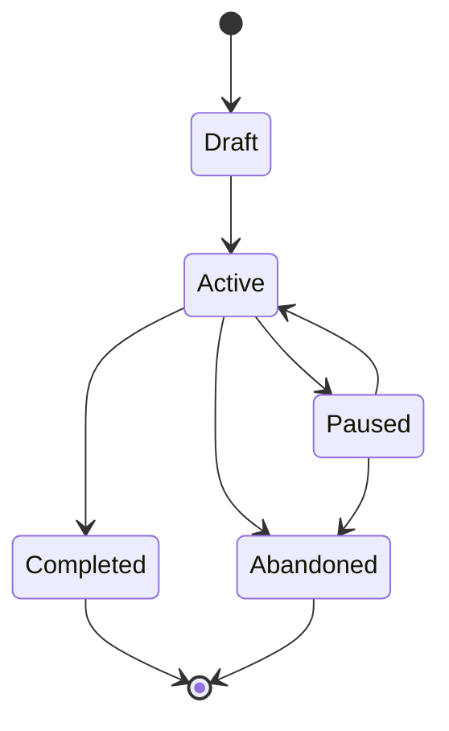

For the MVP, this lifecycle may be simplified if only `active` and `completed` are needed.

---

### Relationships

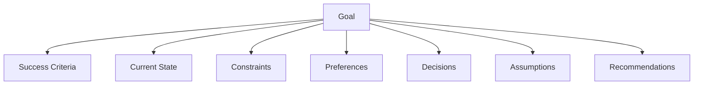

These relationships do not necessarily imply that the Goal directly owns all related data or behavior. They indicate that these concepts are interpreted within the context of a Goal.

---

### MVP Example

#### Goal

> Relocate the family from Tennessee to Northern California.

#### Target window

> Within the next year.

#### Current state

> The family lives in Tennessee, owns a home that will likely need to be sold, and has not selected a destination community.

#### Definition of success

> Complete the move affordably, remain close to family, maintain access to strong employment and healthcare, and find suitable housing.

---

### Open Question

Should **Current State** remain part of the Goal, or should it eventually become an independently defined concept with its own lifecycle?

For the MVP, Current State can remain associated with the Goal until the first reasoning loop demonstrates that it needs to be modeled independently.

The state-change proof temporarily records `relocation_employment_requirements_status`
on the in-memory Goal snapshot. This is relocation-specific scenario state, not
a finalized general property of every Goal. A broader CurrentState or fact model
remains intentionally deferred.

# SuccessCriterion

### What is it?

A **SuccessCriterion** describes a condition that must be true for the user to consider a Goal successful.

A Goal may have several SuccessCriteria because complex goals are rarely judged by a single outcome.

Examples:

* Complete the move without exceeding the overall budget.
* Live within 1.5 hours of family in the San Mateo area.
* Maintain access to high-quality healthcare.
* Ensure the spouse can find meaningful work.
* Find housing with suitable outdoor space.

A SuccessCriterion describes an outcome, not the work required to achieve it.

For example:

> Live within 1.5 hours of family.

is a SuccessCriterion.

> Research East Bay communities.

is an action that may help satisfy that criterion.

---

### What does it know?

For the MVP, a SuccessCriterion may know:

* **Description** — The outcome or condition the user considers important.
* **Priority** — How strongly the criterion contributes to overall success.
* **Status** — Whether the criterion is currently satisfied, unsatisfied, uncertain, or not yet evaluated.
* **Evaluation method** — How the engine or user determines whether the criterion is satisfied.
* **Target value** — An optional measurable threshold.
* **Current value** — An optional known value used for comparison.
* **Evidence** — Information supporting the current status.
* **Source** — Whether the criterion came directly from the user, was inferred by the engine, or was suggested by an expert rule.

A SuccessCriterion may be qualitative or quantitative.

#### Quantitative example

* **Description:** Remain within driving distance of family.
* **Target value:** 1.5 hours or less.
* **Current value:** Unknown until a location is evaluated.

#### Qualitative example

* **Description:** Spouse finds meaningful employment.
* **Evaluation method:** User judgment.
* **Current status:** Uncertain.

---

### What changes it?

A SuccessCriterion may change when:

* The user adds, removes, or revises it.
* The user changes its priority.
* New information changes whether it is satisfied.
* A related decision is made.
* An assumption is validated or invalidated.
* The Goal changes.
* The user decides that the criterion is no longer relevant.
* The engine discovers that the criterion conflicts with another SuccessCriterion or Constraint.

The criterion itself may remain unchanged while its status changes.

For example:

> Maintain access to high-quality healthcare.

may remain a stable criterion while different candidate locations are evaluated against it.

---

### Who uses it?

A SuccessCriterion is used by:

* **Observation** — To identify what information needs to be collected.
* **Representation** — To preserve the user's definition of success in the internal model.
* **Strategic reasoning** — To compare possible directions and reject plans that fail to support the desired outcome.
* **Operational reasoning** — To prioritize decisions and actions that affect important criteria.
* **Recommendation generation** — To align recommendations with the user's intended outcome.
* **Explanation generation** — To explain which SuccessCriteria a recommendation supports.
* **Progress evaluation** — To determine whether the Goal is moving toward a successful outcome.
* **The user interface** — To show how well the current plan aligns with the user's definition of success.

---

### What decisions does it enable?

SuccessCriteria help the engine evaluate questions such as:

* Which options best support the user's desired outcome?
* Which tradeoffs are acceptable?
* Which unresolved decisions have the greatest effect on success?
* What information must be gathered before comparing alternatives?
* Is the current plan still viable?
* Has the Goal actually been achieved?
* Does a recommendation improve one success dimension while harming another?

SuccessCriteria allow the engine to distinguish between completing a project and achieving a satisfactory outcome.

A move may be completed on time but still be unsuccessful if:

* Housing costs exceed the planned budget.
* The family lives too far from relatives.
* Employment opportunities are inadequate.
* Healthcare access is poor.

---

### Lifecycle

A possible SuccessCriterion lifecycle is:

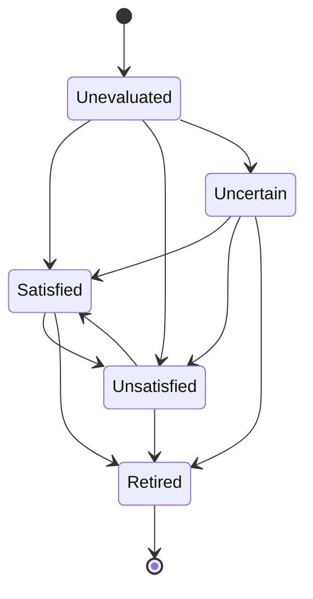

Possible statuses include:

* `unevaluated`
* `uncertain`
* `satisfied`
* `unsatisfied`
* `retired`

For the MVP, this may be simplified to:

* `unknown`
* `satisfied`
* `unsatisfied`

---

### Relationships

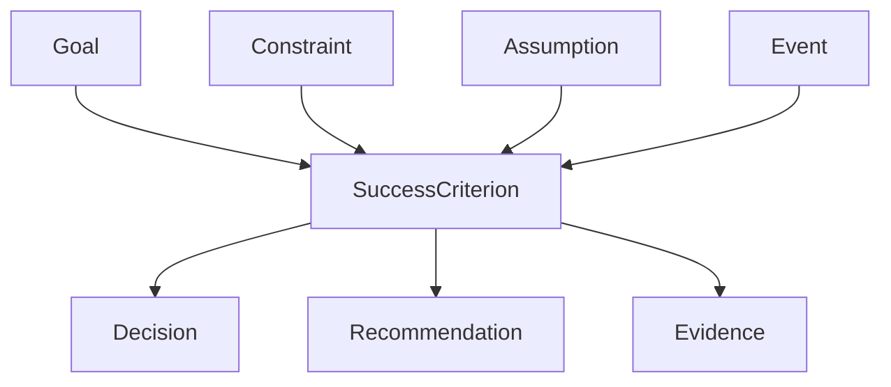

These relationships mean:

* A Goal may have many SuccessCriteria.
* A Decision may affect one or more SuccessCriteria.
* A Recommendation should explain which SuccessCriteria it supports.
* Constraints may establish minimum acceptable outcomes.
* Assumptions and Events may change whether a criterion is considered satisfied.
* Evidence supports the engine's evaluation of a criterion.

---

### MVP Example

#### Goal

> Relocate the family from Tennessee to Northern California.

#### SuccessCriterion 1

* **Description:** Remain within 1.5 hours of family in the San Mateo area.
* **Type:** Quantitative.
* **Target value:** 1.5 hours or less by car.
* **Status:** Unevaluated.
* **Evaluation method:** Estimated driving time from a candidate location.

#### SuccessCriterion 2

* **Description:** Maintain access to high-quality healthcare.
* **Type:** Qualitative.
* **Status:** Unevaluated.
* **Evaluation method:** Compare candidate areas based on access to appropriate healthcare systems and providers.

#### SuccessCriterion 3

* **Description:** Spouse finds meaningful employment that supports the household's cost of living.
* **Type:** Qualitative and financial.
* **Status:** Uncertain.
* **Evaluation method:** User judgment supported by employment opportunities, compensation, commute, and role fit.

#### SuccessCriterion 4

* **Description:** Complete the move without overspending merely to accelerate the timeline.
* **Type:** Financial.
* **Status:** Unevaluated.
* **Evaluation method:** Compare total move-related spending against the agreed budget and expected value.

---

### Distinction From Related Concepts

#### SuccessCriterion vs Constraint

A **Constraint** defines a boundary that a valid plan should not violate.

> Housing must not cost more than the established limit.

A **SuccessCriterion** defines an outcome that contributes to the user's judgment of success.

> The family can afford housing without undermining long-term financial security.

A single concern may produce both a Constraint and a SuccessCriterion.

#### SuccessCriterion vs Preference

A **Preference** helps rank acceptable options.

> Prefer a neighborhood with convenient amenities.

A **SuccessCriterion** contributes directly to whether the Goal is considered successful.

> The chosen location provides adequate access to employment and essential services.

#### SuccessCriterion vs Recommendation

A **SuccessCriterion** describes the desired outcome.

A **Recommendation** proposes a decision or action intended to improve the likelihood of achieving that outcome.

---

### Open Questions

* Does every SuccessCriterion need a priority, or should priority emerge from other concepts?
* Should quantitative and qualitative criteria use the same model?
* Can a SuccessCriterion be mandatory, or should mandatory conditions always be represented as Constraints?
* Should the engine evaluate criteria directly, or should it present evidence and ask the user to evaluate subjective outcomes?
* Do we need a separate concept for evidence, or can evidence remain part of the SuccessCriterion for the MVP?

For the MVP, SuccessCriterion can remain a lightweight concept with:

* Description
* Status
* Optional target
* Optional evaluation method
* Related recommendations and decisions

# Constraint

### What is it?

A **Constraint** defines a boundary that an acceptable plan, decision, or recommendation should not violate.

Constraints narrow the set of valid options before the engine compares or optimizes among them.

Examples:

* Housing must not exceed the established budget.
* The family must remain within 1.5 hours of relatives in the San Mateo area.
* Homes with HOA fees will not be considered.
* The current home must not be sold below the minimum acceptable price.
* The family should not live apart for more than two months.
* Candidate locations must not expose the household to unacceptable sea-level-rise risk.

A Constraint is not a desired outcome.

It defines what must remain true, what must not happen, or what an acceptable option must satisfy.

---

### What does it know?

For the MVP, a Constraint may know:

* **Description** — The boundary or condition that must be respected.
* **Type** — The kind of boundary being represented.
* **Severity** — Whether the Constraint is non-negotiable or flexible.
* **Status** — Whether it is active, satisfied, violated, uncertain, or retired.
* **Evaluation method** — How an option is tested against the Constraint.
* **Threshold** — An optional measurable limit.
* **Unit** — The unit associated with a threshold, such as dollars, hours, or miles.
* **Scope** — Which decisions, recommendations, or options the Constraint applies to.
* **Source** — Whether it came from the user, was inferred by the engine, or was suggested by domain knowledge.
* **Rationale** — Why the Constraint matters.
* **Evidence** — Information used to determine whether the Constraint is satisfied.

Possible Constraint types include:

* Financial
* Geographic
* Temporal
* Environmental
* Family
* Housing
* Legal
* Health
* Lifestyle

#### Quantitative example

* **Description:** Remain within driving distance of family.
* **Threshold:** 1.5
* **Unit:** Hours by car.
* **Severity:** Non-negotiable.

#### Qualitative example

* **Description:** Do not consider neighborhoods with HOA fees.
* **Evaluation method:** Confirm whether the property is governed by an HOA.
* **Severity:** Non-negotiable.

---

### What changes it?

A Constraint may change when:

* The user adds, removes, or revises it.
* The user changes its severity.
* A threshold changes.
* The Goal changes.
* A new fact makes the Constraint irrelevant.
* A major event requires the user to reconsider it.
* The engine discovers that two Constraints conflict.
* The user explicitly approves an exception.
* New evidence changes whether the Constraint is satisfied or violated.

The Constraint itself may remain stable while its evaluation changes.

For example:

> Housing must remain below the established budget.

may remain unchanged while different housing options are tested against it.

---

### Who uses it?

A Constraint is used by:

* **Observation** — To determine which facts and thresholds must be collected.
* **Representation** — To preserve the user's boundaries in the internal model.
* **Strategic reasoning** — To reject directions that are unacceptable.
* **Operational reasoning** — To prevent actions from advancing invalid plans.
* **Decision evaluation** — To test candidate choices.
* **Recommendation generation** — To avoid recommending options that violate stated boundaries.
* **Explanation generation** — To explain why an option was accepted or rejected.
* **Risk evaluation** — To detect when the current plan is approaching a boundary.
* **The user interface** — To show which Constraints are active and whether the current plan satisfies them.

---

### What decisions does it enable?

Constraints help the engine evaluate questions such as:

* Is this option acceptable at all?
* Should this option be rejected before further analysis?
* Which decisions require more information before they can be made?
* Is the current plan approaching or violating a boundary?
* Which recommendations are invalid despite otherwise attractive benefits?
* Does the user need to reconsider a Constraint because no viable option satisfies it?
* Has a changed assumption made the current plan unacceptable?

Constraints allow the engine to distinguish between:

* A valid but less-preferred option.
* An option that should not be considered.
* An option whose acceptability is still uncertain.

---

### Lifecycle

A possible Constraint lifecycle is:

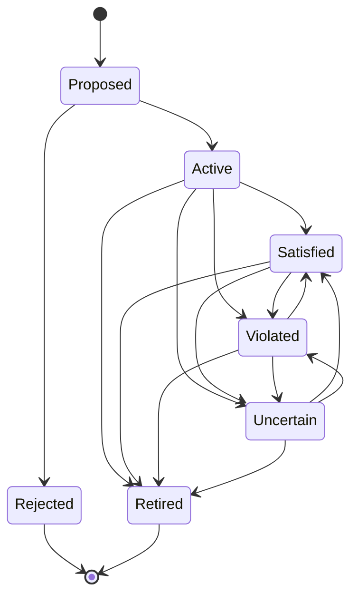

Possible statuses include:

* `proposed`
* `active`
* `satisfied`
* `violated`
* `uncertain`
* `retired`

For the MVP, this may be simplified to:

* `active`
* `satisfied`
* `violated`
* `unknown`

---

### Relationships

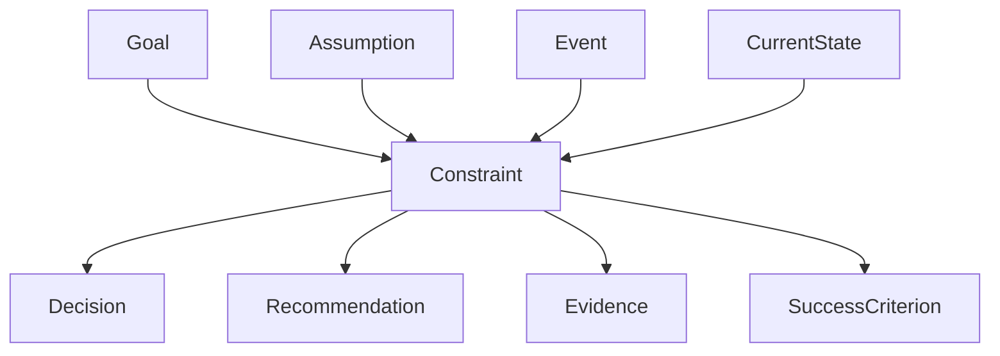

These relationships mean:

* A Goal may have many Constraints.
* A Decision may satisfy, threaten, or violate one or more Constraints.
* A Recommendation should be evaluated against all relevant Constraints.
* Assumptions and Events may change whether a Constraint is satisfied.
* Current State provides the facts used to evaluate the Constraint.
* A Constraint may protect or enforce part of a SuccessCriterion.

---

### MVP Examples

#### Constraint 1

* **Description:** Do not spend more than the established housing limit.
* **Type:** Financial.
* **Severity:** Non-negotiable.
* **Status:** Active.
* **Threshold:** To be defined by the user.
* **Evaluation method:** Compare total monthly or purchase-related housing cost against the approved limit.

#### Constraint 2

* **Description:** Remain within 1.5 hours of family in the San Mateo area.
* **Type:** Geographic.
* **Severity:** Non-negotiable.
* **Status:** Active.
* **Threshold:** 1.5 hours.
* **Evaluation method:** Estimate typical driving time from each candidate location.

#### Constraint 3

* **Description:** Do not consider neighborhoods with HOA fees.
* **Type:** Housing.
* **Severity:** Non-negotiable.
* **Status:** Active.
* **Evaluation method:** Confirm whether the property or community has mandatory HOA fees.

#### Constraint 4

* **Description:** Do not accept less than the minimum approved sale price for the current home.
* **Type:** Financial.
* **Severity:** Non-negotiable.
* **Status:** Active.
* **Threshold:** To be defined by the user.
* **Evaluation method:** Compare an offer's net proceeds against the minimum acceptable amount.

#### Constraint 5

* **Description:** Do not live apart as a family for more than two months.
* **Type:** Family and temporal.
* **Severity:** Strong.
* **Status:** Active.
* **Threshold:** Two months.
* **Evaluation method:** Compare proposed move sequencing against the expected period of separation.

#### Constraint 6

* **Description:** Do not select a location with unacceptable sea-level-rise exposure.
* **Type:** Environmental.
* **Severity:** Non-negotiable.
* **Status:** Active.
* **Evaluation method:** Evaluate candidate locations using an agreed risk standard and authoritative hazard data.

---

### Severity

Not all Constraints may need to be absolute.

A possible severity model is:

* **Non-negotiable** — An option that violates this Constraint should normally be rejected.
* **Strong** — A violation requires explicit user approval and a clear explanation of the tradeoff.
* **Advisory** — The engine should flag the issue but may still recommend the option.

For the MVP, it may be preferable to support only:

* `non_negotiable`
* `flexible`

This keeps the model simple while preserving the important distinction between rejection and tradeoff.

---

### Constraint Evaluation

A Constraint can be evaluated against a specific subject, such as:

* A candidate location.
* A housing option.
* A sale offer.
* A timeline.
* A move sequence.
* A recommendation.

The same Constraint may have different results for different options.

Example:

| Candidate location | Distance Constraint | Housing Constraint | HOA Constraint |
| ------------------ | ------------------- | ------------------ | -------------- |
| Location A         | Satisfied           | Satisfied          | Satisfied      |
| Location B         | Violated            | Satisfied          | Satisfied      |
| Location C         | Satisfied           | Uncertain          | Violated       |

This suggests that the evaluation result may eventually need to exist separately from the Constraint itself.

The Constraint describes the stable rule:

> Remain within 1.5 hours of family.

The evaluation describes how a specific option performs:

> Location B violates the distance Constraint.

For the MVP, the evaluation may remain part of the reasoning output rather than becoming a separate domain concept.

---

### Distinction From Related Concepts

#### Constraint vs SuccessCriterion

A **Constraint** establishes an acceptable boundary.

> Housing must not exceed the approved limit.

A **SuccessCriterion** describes an outcome that contributes to success.

> Housing remains affordable without undermining long-term financial security.

A plan may satisfy all Constraints but still perform poorly against some SuccessCriteria.

#### Constraint vs Preference

A **Constraint** determines whether an option is acceptable.

> Do not consider homes with HOA fees.

A **Preference** helps rank acceptable options.

> Prefer a larger yard.

Violating a Preference may make an option less attractive.

Violating a non-negotiable Constraint normally makes the option invalid.

#### Constraint vs Risk

A **Constraint** describes a boundary.

> The home sale must produce at least the minimum acceptable proceeds.

A **Risk** describes uncertainty about whether the boundary will be met.

> Market conditions may prevent the home from selling at that price.

#### Constraint vs Assumption

A **Constraint** states what must be true.

> The family must remain within the housing budget.

An **Assumption** states something currently believed to be true.

> The spouse will secure enough income to support that housing budget.

An invalidated Assumption may cause a Constraint to become violated.

---

### Open Questions

* Should flexible boundaries remain Constraints, or should they be represented as Preferences?
* Can the user temporarily override a non-negotiable Constraint?
* Should an override create an exception record with a rationale?
* Does severity belong on the Constraint, or should all Constraints be absolute?
* Should Constraint evaluation be modeled as a separate concept?
* How should the engine handle two Constraints that cannot both be satisfied?
* Should the engine ever suggest revising a Constraint?
* Does the MVP need typed thresholds, or is a description plus evaluation rule sufficient?

For the MVP, Constraint can remain a lightweight concept with:

* Description
* Severity
* Status
* Optional threshold
* Optional evaluation method
* Related decisions and recommendations

# Preference

### What is it?

A **Preference** describes something the user would like an acceptable plan, decision, or recommendation to satisfy.

Preferences help the engine compare valid options after relevant Constraints have been applied.

Examples:

* Prefer a home with outdoor living space.
* Prefer a location with nearby amenities.
* Prefer an area with strong job opportunities for the daughter.
* Prefer to minimize the amount of time the family lives apart.
* Prefer a shorter commute.
* Prefer to reduce moving stress.

A Preference does not usually make an option invalid.

Instead, it influences how acceptable options are ranked.

---

### What does it know?

For the MVP, a Preference may know:

* **Description** — What the user would like.
* **Priority** — How important the Preference is relative to other Preferences.
* **Status** — Whether it is active, satisfied, unsatisfied, uncertain, or retired.
* **Evaluation method** — How an option is assessed against the Preference.
* **Target value** — An optional desired value.
* **Current value** — An optional known value.
* **Scope** — Which decisions, recommendations, or options the Preference applies to.
* **Source** — Whether it came directly from the user, was inferred by the engine, or was suggested by domain knowledge.
* **Rationale** — Why the Preference matters.
* **Tradeoff tolerance** — How willing the user is to sacrifice this Preference to satisfy something more important.

Possible Preference types include:

* Financial
* Geographic
* Lifestyle
* Family
* Employment
* Health
* Housing
* Convenience
* Time
* Emotional well-being

#### Quantitative example

* **Description:** Prefer a commute under 30 minutes.
* **Target value:** 30 minutes or less.
* **Priority:** Medium.

#### Qualitative example

* **Description:** Prefer a home with useful outdoor living space.
* **Evaluation method:** User judgment based on the property.
* **Priority:** High.

---

### What changes it?

A Preference may change when:

* The user adds, removes, or revises it.
* The user changes its priority.
* The Goal changes.
* A related Constraint changes.
* The user learns more about the available tradeoffs.
* A major event makes the Preference more or less important.
* The user accepts an option that does not satisfy it.
* The Preference becomes irrelevant.
* Experience causes the user to refine what they value.

The Preference itself may remain unchanged while different options are evaluated against it.

For example:

> Prefer outdoor living space.

may remain stable while candidate homes receive different evaluations.

---

### Who uses it?

A Preference is used by:

* **Observation** — To identify what the user values beyond minimum acceptability.
* **Representation** — To preserve the user's priorities in the internal model.
* **Strategic reasoning** — To compare otherwise valid directions.
* **Operational reasoning** — To prioritize research, decisions, and actions that affect important Preferences.
* **Decision evaluation** — To rank candidate options.
* **Recommendation generation** — To choose among alternatives that satisfy all relevant Constraints.
* **Explanation generation** — To explain the tradeoffs behind a recommendation.
* **The user interface** — To show why one acceptable option ranks above another.

---

### What decisions does it enable?

Preferences help the engine evaluate questions such as:

* Which acceptable option best fits the user's priorities?
* Which tradeoffs are worth making?
* Which differences between options matter most?
* What should be optimized after all Constraints are satisfied?
* Which option should rank highest?
* Does one option satisfy more high-priority Preferences than another?
* Should the engine ask the user to clarify competing priorities?
* Has the user's preferred balance changed?

Preferences allow the engine to distinguish between:

* An unacceptable option.
* An acceptable option.
* The best available acceptable option.

---

### Lifecycle

A possible Preference lifecycle is:

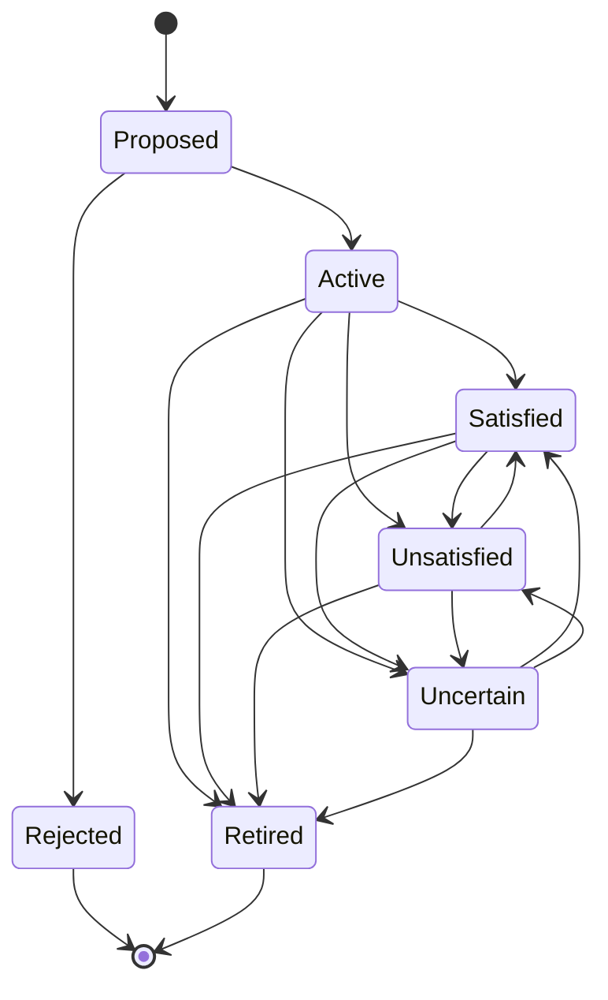

Possible statuses include:

* `proposed`
* `active`
* `satisfied`
* `unsatisfied`
* `uncertain`
* `retired`

For the MVP, this may be simplified to:

* `active`
* `satisfied`
* `unsatisfied`
* `unknown`

---

### Relationships

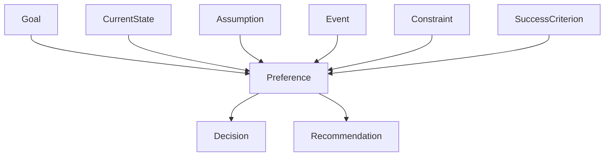

These relationships mean:

* A Goal may have many Preferences.
* A Decision may satisfy or conflict with one or more Preferences.
* A Recommendation may be ranked partly by how well it satisfies Preferences.
* Current State, Assumptions, and Events may change how achievable a Preference is.
* Constraints determine whether an option is valid before Preferences are used to rank it.
* A Preference may support a broader SuccessCriterion.

---

### MVP Examples

#### Preference 1

* **Description:** Prefer a home with outdoor living space.
* **Type:** Housing and lifestyle.
* **Priority:** High.
* **Status:** Active.
* **Evaluation method:** User judgment based on the usefulness and quality of the outdoor area.

#### Preference 2

* **Description:** Prefer a location with convenient amenities.
* **Type:** Lifestyle and convenience.
* **Priority:** Medium.
* **Status:** Active.
* **Evaluation method:** Compare access to shopping, dining, recreation, and essential services.

#### Preference 3

* **Description:** Prefer an area with useful job opportunities for the daughter.
* **Type:** Employment and family.
* **Priority:** Medium.
* **Status:** Active.
* **Evaluation method:** Compare the quantity, quality, and accessibility of suitable employment opportunities.

#### Preference 4

* **Description:** Prefer to minimize the time the family lives apart during the move.
* **Type:** Family and time.
* **Priority:** High.
* **Status:** Active.
* **Evaluation method:** Compare proposed move sequences by expected separation duration.

#### Preference 5

* **Description:** Prefer to avoid unnecessary spending simply to accelerate the move.
* **Type:** Financial.
* **Priority:** High.
* **Status:** Active.
* **Evaluation method:** Compare added cost against the value of the time saved.

---

### Priority

Preferences often compete, so the engine needs a way to understand relative importance.

A possible priority model is:

* **High** — Strongly influences recommendation ranking.
* **Medium** — Meaningfully influences ranking.
* **Low** — Used as a tie-breaker when more important factors are similar.

For the MVP, the simplest useful model may be:

* `high`
* `medium`
* `low`

A more advanced model could support explicit ranking, weighting, or pairwise comparison.

---

### Tradeoffs

Preferences become especially useful when no option satisfies all of them.

Example:

| Candidate  | Outdoor Space | Amenities | Daughter's Job Access | Housing Cost |
| ---------- | ------------- | --------- | --------------------- | ------------ |
| Location A | Strong        | Medium    | Strong                | Higher       |
| Location B | Medium        | Strong    | Medium                | Lower        |
| Location C | Weak          | Medium    | Strong                | Lowest       |

The engine should not hide these tradeoffs.

A transparent recommendation should explain:

* Which Preferences the recommended option satisfies.
* Which Preferences it sacrifices.
* Why that tradeoff is reasonable.
* Whether the result depends on uncertain information.

For example:

> Location A ranks highest because it best supports outdoor living and employment access, both of which are high-priority Preferences. It costs more than Location B, but remains within the housing Constraint.

---

### Preference Evaluation

A Preference describes the stable desire:

> Prefer a home with outdoor living space.

An evaluation describes how a specific option performs:

> Home A strongly satisfies the outdoor-space Preference.

The same Preference may be evaluated differently for each option.

For the MVP, the evaluation may remain part of the reasoning output rather than becoming a separate domain concept.

---

### Distinction From Related Concepts

#### Preference vs Constraint

A **Constraint** determines whether an option is acceptable.

> Do not consider neighborhoods with HOA fees.

A **Preference** helps rank acceptable options.

> Prefer a larger yard.

Violating a non-negotiable Constraint usually invalidates an option.

Failing to satisfy a Preference usually makes an option less desirable.

#### Preference vs SuccessCriterion

A **SuccessCriterion** helps define whether the overall Goal was successful.

> The chosen location supports the family's long-term quality of life.

A **Preference** helps compare specific options.

> Prefer a walkable neighborhood with nearby amenities.

A Preference may support one or more SuccessCriteria.

#### Preference vs Optimization Target

An **Optimization Target** describes a direction such as:

> Minimize commute time.

A **Preference** describes what the user values:

> Prefer a commute under 30 minutes.

These may eventually become separate concepts, but for the MVP an Optimization Target can be represented as a Preference with an evaluation method.

#### Preference vs Recommendation

A **Preference** describes what the user values.

A **Recommendation** proposes the option, decision, or action that best balances relevant Preferences while respecting Constraints.

---

### Open Questions

* Does every Preference need an explicit priority?
* Should Preferences be ranked, weighted, or grouped?
* Can the engine infer a Preference, or must the user confirm it first?
* Should competing Preferences trigger a clarification request?
* Is an Optimization Target a separate concept or a specialized Preference?
* Should Preference evaluation be modeled separately from the Preference?
* How should the engine explain tradeoffs involving subjective Preferences?
* Can a repeatedly sacrificed Preference reveal that it should actually be a Constraint?
* Can a Preference apply globally, or must it always belong to one Goal?

For the MVP, Preference can remain a lightweight concept with:

* Description
* Priority
* Status
* Optional evaluation method
* Related decisions and recommendations

# Decision

### What is it?

A **Decision** represents a choice that must be made, is being considered, or has already been resolved.

Decisions are central to GoTime because many important forms of progress are not tasks. They are choices that determine which actions, projects, and timelines become valid.

Examples:

* Choose the target city.
* Decide whether to rent or buy.
* Select a realtor.
* Choose whether one spouse should move first.
* Decide when to list the current home.
* Select a moving company.

A Decision is different from an action.

> Choose the target city.

is a Decision.

> Research three candidate cities.

is an action that may support the Decision.

A Decision may block or enable other Decisions, actions, projects, or recommendations.

---

### What does it know?

For the MVP, a Decision may know:

* **Title** — A concise description of the choice to be made.
* **Description** — Additional context about the Decision.
* **Status** — The Decision's current lifecycle state.
* **Options** — The known alternatives being considered.
* **Selected option** — The option chosen when the Decision is resolved.
* **Decision owner** — The person or group responsible for making the Decision.
* **Target date** — An optional date by which the Decision should be made.
* **Readiness** — Whether enough information exists to make the Decision responsibly.
* **Required information** — Information that should be available before the Decision is made.
* **Dependencies** — Decisions, actions, assumptions, or events that affect this Decision.
* **Downstream effects** — Work that becomes possible after the Decision is resolved.
* **Related Constraints** — Boundaries that valid options must satisfy.
* **Related Preferences** — Factors used to compare acceptable options.
* **Related SuccessCriteria** — Outcomes the Decision may support or threaten.
* **Rationale** — Why the selected option was chosen.
* **Evidence** — Information used to support the Decision.
* **Reversibility** — How difficult or costly it would be to reconsider the Decision.

For the MVP, the most important fields may be:

* Title
* Status
* Options
* Selected option
* Readiness
* Dependencies
* Downstream effects
* Rationale

---

### What changes it?

A Decision may change when:

* The user creates it.
* The engine identifies that a choice is required.
* New options are added or removed.
* New information becomes available.
* A dependency is completed.
* An assumption is validated or invalidated.
* An external event occurs.
* The Decision becomes ready.
* The user selects an option.
* The user postpones the Decision.
* The selected option is reconsidered.
* The Decision is invalidated by a major change.
* The Decision is no longer relevant.

A Decision may remain unresolved while its readiness changes.

For example:

> Choose the target city.

may move from `not_ready` to `ready` after employment, affordability, family proximity, and healthcare information have been gathered.

---

### Who uses it?

A Decision is used by:

* **Observation** — To identify which important choices remain unresolved.
* **Representation** — To preserve choices, options, dependencies, and outcomes in the internal model.
* **Strategic reasoning** — To determine which options are acceptable.
* **Operational reasoning** — To determine when the Decision should be made and what it blocks.
* **Sequencing** — To order the Decision relative to other Decisions and actions.
* **Decision readiness evaluation** — To determine whether enough information exists to proceed.
* **Recommendation generation** — To recommend making, preparing for, or postponing a Decision.
* **Explanation generation** — To explain why the Decision matters and why it should or should not happen now.
* **Progress evaluation** — To identify which parts of the Goal remain unresolved.
* **The user interface** — To show pending Decisions, their readiness, and their consequences.

---

### What decisions does it enable?

Although a Decision is itself a choice, modeling it enables the engine to answer questions such as:

* Which Decision should be made next?
* Is this Decision ready?
* What information is still missing?
* Which options violate Constraints?
* Which option best satisfies Preferences?
* What work is blocked until this Decision is made?
* What becomes possible after it is resolved?
* Is the Decision overdue?
* Is it too early to decide?
* Should the Decision be revisited because an assumption changed?
* How costly would it be to reverse the Decision?

A Decision allows GoTime to recommend more than tasks.

The engine can say:

> Do not begin the housing search yet. First determine the target employment area because commute requirements may eliminate several otherwise acceptable locations.

---

### Lifecycle

A possible Decision lifecycle is:

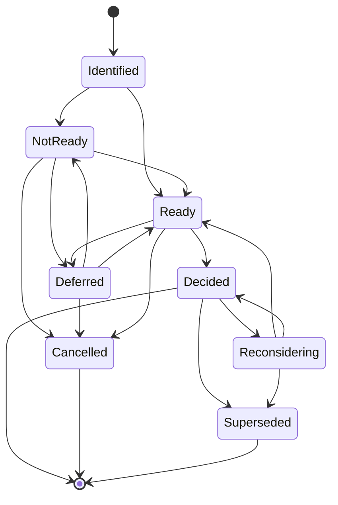

Possible statuses include:

* `identified`
* `not_ready`
* `ready`
* `deferred`
* `decided`
* `reconsidering`
* `cancelled`
* `superseded`

For the MVP, this may be simplified to:

* `pending`
* `ready`
* `decided`

Readiness may also be modeled separately from status.

For example:

* **Status:** Pending
* **Readiness:** Not ready

This distinction may be useful because a Decision can remain pending while becoming ready.

---

### Decision Readiness

Decision readiness answers:

> Is there enough information to make this Decision responsibly?

A Decision may be:

* **Not ready** — Important information or dependencies are missing.
* **Partially ready** — Some options can be evaluated, but uncertainty remains.
* **Ready** — The available information is sufficient to choose.
* **Overdue** — The Decision should already have been made because downstream work is now at risk.

Example:

#### Decision

> Choose the target location.

#### Required information

* Spouse employment requirements.
* Housing affordability.
* Distance from family.
* Healthcare access.
* Sea-level-rise exposure.

#### Readiness

> Partially ready.

#### Reason

> Candidate regions can be narrowed now, but a final location should wait until employment requirements are clearer.

Decision readiness is one of the main ways GoTime can distinguish between:

* Work that should happen now.
* Work that should be prepared now.
* Work that should wait.

---

### Relationships

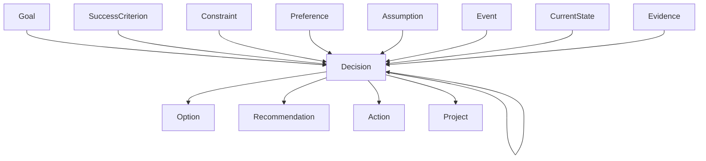

These relationships mean:

* A Goal may have many Decisions.
* SuccessCriteria influence how options are judged.
* Constraints eliminate invalid options.
* Preferences help rank valid options.
* Assumptions and Events may change Decision readiness.
* One Decision may depend on another Decision.
* A resolved Decision may enable actions, projects, or further Decisions.
* Recommendations may advise the user to prepare for, make, defer, or revisit a Decision.

---

### Decision Dependencies

A Decision may depend on:

* Another Decision.
* An action being completed.
* Information being collected.
* An assumption being validated.
* An external event occurring.
* A date or deadline being reached.

Example:

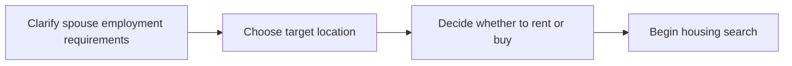

This sequence contains different kinds of work:

* Clarifying employment requirements may be an action.
* Choosing the target location is a Decision.
* Choosing whether to rent or buy is another Decision.
* Beginning the housing search is an action or project.

GoTime should be able to sequence all of them together.

---

### Downstream Effects

A Decision should identify what becomes possible after it is resolved.

Example:

#### Decision

> Choose the target location.

#### Downstream work enabled

* Neighborhood research.
* Realtor selection.
* Housing search.
* Commute analysis.
* Healthcare-provider research.
* More accurate moving estimates.

This allows the engine to recognize high-leverage Decisions.

A Decision that enables many important workstreams may deserve higher priority than one with limited downstream impact.

---

### MVP Example

#### Decision

> Choose the target location in Northern California.

#### Status

> Pending.

#### Readiness

> Partially ready.

#### Options

* East Bay.
* North Bay.
* Peninsula-adjacent communities.
* Other communities within the accepted family-distance limit.

#### Required information

* Spouse employment requirements.
* Housing budget.
* Typical driving time to family.
* Healthcare access.
* Environmental risk.
* Job opportunities for the daughter.

#### Related Constraints

* Housing must remain below the approved limit.
* The location must remain within 1.5 hours of family.
* The location must not have unacceptable sea-level-rise risk.
* The housing options must not require HOA fees.

#### Related Preferences

* Outdoor living space.
* Nearby amenities.
* Strong job opportunities for the daughter.
* Reduced family disruption.

#### Downstream effects

Resolving this Decision enables:

* Neighborhood comparison.
* Housing research.
* Realtor outreach.
* Commute analysis.
* Healthcare research.
* Moving-cost estimates.

#### Recommendation

> Narrow the location search to a small set of candidate areas now, but postpone the final Decision until spouse employment requirements are clearer.

#### Explanation

> The target location affects housing, employment, healthcare, and move logistics. Enough information exists to narrow the field, but choosing a final location now could create unnecessary rework if employment needs change.

---

### Distinction From Related Concepts

#### Decision vs Action

A **Decision** is a choice.

> Choose a target city.

An **Action** is work performed.

> Compare housing costs in three target cities.

Actions may prepare for or implement Decisions.

#### Decision vs Recommendation

A **Decision** is a choice that exists within the user's plan.

A **Recommendation** is advice from the engine about that Decision.

Examples:

* Make the Decision now.
* Gather more information first.
* Reject a specific option.
* Reconsider the Decision.
* Defer the Decision until a dependency changes.

#### Decision vs Event

A **Decision** is intentionally made by a person or group.

> Accept a job offer.

An **Event** happens and changes the state of the world.

> A job offer arrives.

Events may create or change Decisions.

#### Decision vs Assumption

A **Decision** records a choice.

> We will rent for the first year.

An **Assumption** records something believed but not confirmed.

> Suitable rental housing will be available.

A Decision may depend on an Assumption.

#### Decision vs Task

A **Decision** resolves uncertainty by choosing among alternatives.

A **Task** represents work that must be completed.

Traditional task managers often hide Decisions inside tasks.

GoTime should model them separately because Decisions have:

* Options.
* Readiness.
* Tradeoffs.
* Consequences.
* Rationale.

---

### Reversibility

Not all Decisions carry the same consequences.

A possible reversibility model is:

* **Easily reversible** — Can be changed with little cost or disruption.
* **Reversible with cost** — Can be changed, but doing so creates meaningful expense or delay.
* **Difficult to reverse** — Reconsideration is possible but highly disruptive.
* **Effectively irreversible** — The Decision cannot realistically be undone.

Examples:

* Choosing which neighborhoods to research is easily reversible.
* Signing a one-year lease is reversible with cost.
* Selling the current home is difficult to reverse.

Reversibility may affect sequencing.

The engine may recommend:

> Delay the difficult-to-reverse Decision until the most important uncertainty is resolved.

For the MVP, reversibility may remain optional.

---

### Open Questions

* Should readiness be part of Decision status or a separate property?
* Does the MVP need an explicit `Option` concept?
* Should every Decision have a named owner?
* Can the engine create Decisions automatically, or must the user confirm them?
* How should the engine handle joint Decisions involving several people?
* Does a resolved Decision remain editable?
* When should a Decision become `superseded` rather than simply edited?
* Should rationale be required when a Decision is resolved?
* Does reversibility need to be modeled in the MVP?
* Should downstream effects be stored explicitly or inferred from dependencies?
* Can one Decision partially resolve another?
* How should the engine represent Decisions that must be made repeatedly?

For the MVP, Decision can remain a focused concept with:

* Title
* Status
* Readiness
* Options
* Selected option
* Dependencies
* Downstream effects
* Related Constraints and Preferences
* Rationale

# Assumption

### What is it?

An **Assumption** represents something the user or engine currently believes to be true, even though it has not been fully confirmed.

Assumptions allow planning to continue under uncertainty.

Examples:

* The current home will sell above the minimum acceptable price.
* The spouse will find meaningful work in Northern California.
* Suitable rental housing will be available.
* The family will still want to move within the next year.
* Interest rates will remain within an affordable range.
* The daughter will be able to find acceptable employment near the chosen location.

An Assumption is not a fact.

It is a provisional belief that may influence Decisions, Recommendations, and sequencing until better evidence becomes available.

---

### What does it know?

For the MVP, an Assumption may know:

* **Description** — The belief currently being treated as true.
* **Status** — Whether the Assumption is untested, supported, validated, weakened, invalidated, or retired.
* **Confidence** — How strongly the Assumption is currently believed.
* **Evidence** — Information that supports or weakens it.
* **Source** — Whether it came from the user, the engine, or domain knowledge.
* **Owner** — The person responsible for confirming it, if applicable.
* **Review date** — An optional date when it should be reconsidered.
* **Validation method** — How it can be confirmed or disproved.
* **Impact** — How much the plan depends on it.
* **Related Decisions** — Decisions that rely on the Assumption.
* **Related Recommendations** — Recommendations whose validity depends on it.
* **Related Constraints** — Constraints that may become threatened if it proves false.
* **Related SuccessCriteria** — Outcomes that may be affected if it changes.

For the MVP, the most important fields may be:

* Description
* Status
* Confidence
* Evidence
* Impact
* Related Decisions
* Validation method

---

### What changes it?

An Assumption may change when:

* New evidence becomes available.
* The user confirms or rejects it.
* A related Decision is made.
* An external Event occurs.
* A deadline passes without confirmation.
* A source of evidence becomes outdated.
* The engine detects conflicting information.
* The Assumption is no longer relevant.
* The Goal changes.
* The plan becomes too dependent on an uncertain belief.

An Assumption may remain in place while confidence rises or falls.

For example:

> The current home will sell above the minimum acceptable price.

may move from low confidence to moderate confidence after a market analysis, then to validated after an acceptable offer is accepted.

---

### Who uses it?

An Assumption is used by:

* **Observation** — To identify beliefs that should not be treated as confirmed facts.
* **Representation** — To preserve uncertainty explicitly in the internal model.
* **Strategic reasoning** — To determine whether a plan is too dependent on uncertain conditions.
* **Operational reasoning** — To decide whether work should continue, pause, or gather more evidence.
* **Decision readiness evaluation** — To determine whether a Decision can be made responsibly.
* **Sequencing** — To prioritize validating important Assumptions before irreversible Decisions.
* **Recommendation generation** — To qualify advice that depends on uncertain information.
* **Explanation generation** — To reveal which Assumptions support a Recommendation.
* **Risk evaluation** — To identify what may go wrong if an Assumption proves false.
* **Continuous re-evaluation** — To update the plan when an Assumption is validated or invalidated.
* **The user interface** — To show which parts of the plan depend on uncertainty.

---

### What decisions does it enable?

Assumptions help the engine evaluate questions such as:

* Which beliefs are influencing the current plan?
* Which Assumptions need validation before an important Decision?
* Which Assumptions can safely remain unresolved for now?
* How much of the plan depends on uncertain information?
* What happens if this Assumption proves false?
* Should a Recommendation be presented as conditional?
* Should an irreversible Decision be delayed?
* Has new evidence changed the best next step?
* Is the current plan still viable?
* Which Assumption presents the greatest threat to success?

Assumptions allow the engine to say:

> This recommendation is reasonable only if the spouse can secure employment at the expected income level.

rather than presenting uncertain reasoning as certainty.

---

### Lifecycle

A possible Assumption lifecycle is:

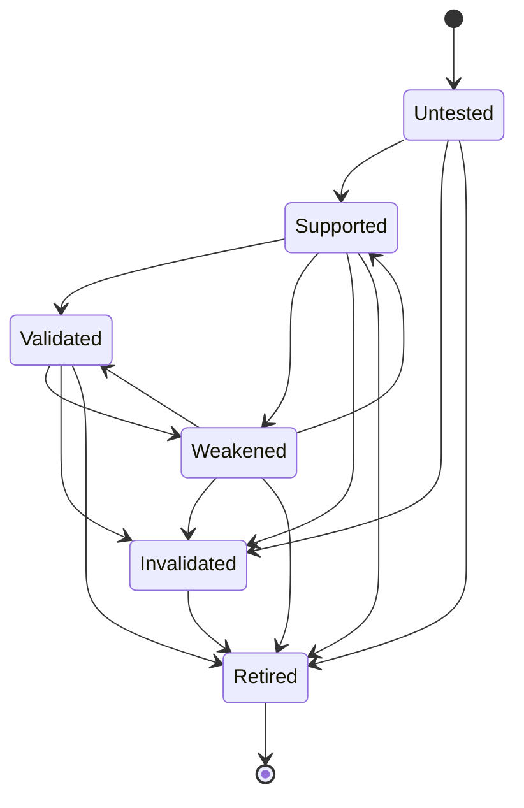

Possible statuses include:

* `untested`
* `supported`
* `validated`
* `weakened`
* `invalidated`
* `retired`

For the MVP, this may be simplified to:

* `unconfirmed`
* `supported`
* `validated`
* `invalidated`

Confidence may be represented separately from status.

---

### Confidence

Confidence expresses how strongly the Assumption is currently believed.

A possible model is:

* **Low** — Little evidence supports it.
* **Medium** — Some evidence supports it, but uncertainty remains.
* **High** — Strong evidence supports it, though it is not fully confirmed.
* **Confirmed** — The Assumption has effectively become a fact.

For the MVP, confidence may be optional.

Status alone may be enough until the reasoning loop proves that more detail is required.

---

### Impact

Not every Assumption matters equally.

A possible impact model is:

* **Low impact** — If false, only minor adjustments are needed.
* **Medium impact** — If false, some Decisions or timelines must change.
* **High impact** — If false, major portions of the plan must be reconsidered.
* **Plan-critical** — If false, the current strategy may no longer be viable.

Examples:

* Assuming a specific neighborhood will have enough restaurants may be low impact.
* Assuming the spouse can find meaningful employment may be plan-critical.
* Assuming the current home will sell above a minimum amount may be high impact or plan-critical.

The engine should prioritize validating Assumptions with both:

* High uncertainty.
* High impact.

---

### Relationships

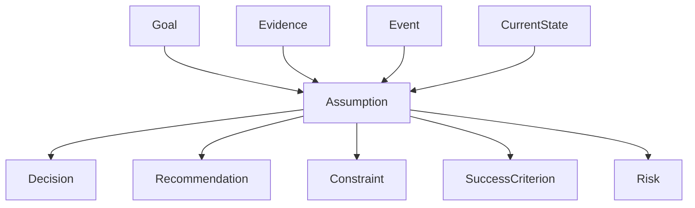

These relationships mean:

* A Goal may contain many Assumptions.
* Decisions may rely on one or more Assumptions.
* Recommendations may be conditional on Assumptions remaining valid.
* An invalidated Assumption may cause a Constraint violation.
* Assumptions may affect whether SuccessCriteria remain achievable.
* Risks often describe what could happen if an Assumption proves false.
* Evidence and Events change Assumption status and confidence.

---

### Assumption Dependencies

A Decision or Recommendation may depend on an Assumption.

Example:

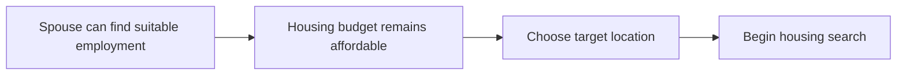

If the employment Assumption weakens, the engine may need to:

* Recalculate the housing budget.
* Reconsider candidate locations.
* Delay a housing Decision.
* Recommend validating employment options first.

---

### MVP Examples

#### Assumption 1

* **Description:** The spouse can find meaningful work that supports the household's expected cost of living.
* **Status:** Unconfirmed.
* **Confidence:** Medium.
* **Impact:** Plan-critical.
* **Validation method:** Research relevant employers, roles, compensation, and work arrangements.
* **Related Decisions:**

  * Choose the target location.
  * Set the housing budget.
  * Decide when the family should move.
* **Failure consequence:** Candidate locations or housing costs may need to be reconsidered.

#### Assumption 2

* **Description:** The current home will sell for at least the minimum acceptable amount.
* **Status:** Supported.
* **Confidence:** Medium.
* **Impact:** High.
* **Validation method:** Obtain market analysis, realtor opinions, and actual offers.
* **Related Decisions:**

  * Set the relocation budget.
  * Decide whether to rent or buy.
  * Determine the timing of the move.
* **Failure consequence:** The move may require a smaller housing budget, a delayed timeline, or a different financing approach.

#### Assumption 3

* **Description:** Suitable dog-friendly rental housing will be available in the target area.
* **Status:** Unconfirmed.
* **Confidence:** Medium.
* **Impact:** Medium.
* **Validation method:** Review current rental inventory and pet policies.
* **Related Decisions:**

  * Choose whether to rent initially.
  * Select a target location.
* **Failure consequence:** The family may need to expand the search area, increase the budget, or reconsider buying.

#### Assumption 4

* **Description:** The family's preferred move window will remain feasible.
* **Status:** Unconfirmed.
* **Confidence:** Medium.
* **Impact:** High.
* **Validation method:** Monitor employment timing, home sale timing, housing availability, and family commitments.
* **Related Decisions:**

  * When to list the current home.
  * When to hire movers.
  * Whether one person should move first.
* **Failure consequence:** The sequence may need to change.

---

### Validation

An Assumption should have a clear path toward confirmation whenever possible.

Examples:

| Assumption                                  | Validation method                               |
| ------------------------------------------- | ----------------------------------------------- |
| Home will sell above the minimum amount     | Realtor analysis and actual offers              |
| Spouse can find meaningful employment       | Job-market research, interviews, or offer       |
| Rental housing will accept a dog            | Review listings and confirm pet policies        |
| Candidate area has strong healthcare access | Verify providers, systems, and insurance access |
| Move can occur within the target window     | Compare dependencies and lead times             |

The engine should distinguish between:

* Assumptions that can be validated now.
* Assumptions that can only be tested later.
* Assumptions that may remain uncertain throughout the plan.

---

### Conditional Recommendations

A Recommendation that depends on an Assumption should say so explicitly.

Example:

> Begin narrowing candidate locations now, assuming your spouse's employment can remain flexible across the region. If employment becomes location-specific, re-evaluate the shortlist before making a final Decision.

This is more trustworthy than presenting the same Recommendation without qualification.

---

### Assumption Invalidation

When an Assumption is invalidated, the engine should determine:

* Which Decisions relied on it.
* Which Recommendations are now stale.
* Which Constraints may now be threatened.
* Which SuccessCriteria may no longer be achievable.
* Whether the current plan needs adjustment or full reconsideration.
* What the new recommended next step should be.

Example:

> The spouse's role now requires commuting to San Francisco three days per week.

This may invalidate the earlier Assumption that employment location was flexible.

The engine may then:

* Re-rank candidate locations.
* Recalculate commute tradeoffs.
* Reconsider the housing budget.
* Replace the current Recommendation.

---

### Distinction From Related Concepts

#### Assumption vs Fact

A **Fact** is treated as currently known and confirmed.

> The family currently lives in Tennessee.

An **Assumption** is believed but not fully confirmed.

> The current home will sell above the minimum price.

The engine should not treat both with equal certainty.

#### Assumption vs Constraint

A **Constraint** defines a boundary.

> Housing must remain below the approved limit.

An **Assumption** supports the belief that the boundary can be satisfied.

> Household income will be sufficient to support that housing limit.

#### Assumption vs Risk

An **Assumption** states what is currently believed.

> The home will sell within four months.

A **Risk** describes an uncertain negative outcome.

> The home may take longer than four months to sell.

The two concepts are often linked but are not identical.

#### Assumption vs Decision

An **Assumption** is a provisional belief.

> Renting will provide enough flexibility.

A **Decision** records a choice.

> Rent for the first year.

A Decision may be based on one or more Assumptions.

#### Assumption vs Evidence

An **Assumption** is the belief being evaluated.

**Evidence** is the information used to support or challenge it.

---

### Open Questions

* Does the MVP need explicit confidence levels?
* Should impact be required or inferred?
* Can the engine create Assumptions automatically?
* Must the user confirm an engine-generated Assumption?
* When does a validated Assumption become a Fact?
* Do we need a separate Fact concept?
* Should each Assumption have a review date?
* How should conflicting evidence be represented?
* Should Assumptions expire when their evidence becomes outdated?
* Can one Assumption depend on another?
* Should invalidating a plan-critical Assumption automatically trigger plan reconsideration?
* Does Evidence need to become a separate domain concept?

For the MVP, Assumption can remain a focused concept with:

* Description
* Status
* Optional confidence
* Impact
* Validation method
* Related Decisions
* Related Recommendations

# Recommendation

### What is it?

A **Recommendation** is an explained suggestion from the reasoning engine about what the user should do, decide, prepare for, postpone, reconsider, or monitor next.

A Recommendation is the primary output of GoTime.

Examples:

* Narrow the target location to three candidate regions.
* Delay the final housing Decision until employment requirements are clearer.
* Obtain a professional market analysis before setting the minimum acceptable sale price.
* Begin interviewing realtors now.
* Reconsider the move timeline because a critical Assumption has weakened.
* Monitor rental availability before committing to a rent-first strategy.

A Recommendation is not merely a task.

It may advise the user to:

* Make a Decision.
* Perform an Action.
* Gather information.
* Wait.
* Reconsider an earlier choice.
* Validate an Assumption.
* Respond to a Risk.
* Change the sequence of work.

A Recommendation should always explain why it was produced.

---

### What does it know?

For the MVP, a Recommendation may know:

* **Title** — A concise description of the suggested next step.
* **Description** — Additional detail about what is being recommended.
* **Type** — The kind of response the engine is proposing.
* **Status** — Whether the Recommendation is active, accepted, dismissed, completed, stale, or superseded.
* **Priority** — How urgently or strongly the Recommendation should be considered.
* **Reasoning** — Why the engine produced it.
* **Why now** — Why the Recommendation matters at this point in the sequence.
* **Evidence** — Facts, assumptions, constraints, preferences, or domain rules supporting it.
* **Dependencies** — Conditions that must be satisfied before it can be acted upon.
* **Blocked items** — Work that remains blocked until the Recommendation is followed.
* **Waiting on** — External information or events that affect the Recommendation.
* **Downstream effects** — Decisions or actions that become possible afterward.
* **Related Goal** — The Goal the Recommendation supports.
* **Related Decision** — The Decision the Recommendation may prepare, resolve, defer, or revisit.
* **Related Constraints** — Boundaries the Recommendation respects or protects.
* **Related Preferences** — Preferences it attempts to satisfy.
* **Related SuccessCriteria** — Outcomes it is intended to support.
* **Related Assumptions** — Beliefs on which its validity depends.
* **Confidence** — How strongly the engine supports it.
* **Generated date** — When it was produced.
* **Review trigger** — What change should cause it to be re-evaluated.

For the MVP, the most important fields may be:

* Title
* Type
* Status
* Reasoning
* Why now
* Related Decision
* Dependencies
* Blocked items
* Related Assumptions
* Generated date

---

### Recommendation Types

A possible type model includes:

* **Decide** — Make a Decision now.
* **Prepare** — Gather information or complete work needed for a future Decision.
* **Act** — Perform a concrete Action.
* **Wait** — Do not proceed until a condition changes.
* **Monitor** — Watch an Assumption, Risk, Event, or deadline.
* **Validate** — Confirm or challenge an Assumption.
* **Reconsider** — Revisit an earlier Decision or plan.
* **Escalate** — Bring attention to a growing Risk or Constraint violation.

Examples:

#### Decide

> Select the target city from the remaining valid options.

#### Prepare

> Research spouse employment requirements before finalizing the location.

#### Act

> Schedule realtor interviews this month.

#### Wait

> Do not sign a lease until the move date is more certain.

#### Monitor

> Track rental availability in the two leading candidate areas.

#### Validate

> Obtain a market analysis to test the expected home-sale proceeds.

#### Reconsider

> Revisit the housing budget because the employment Assumption has weakened.

For the MVP, these may be simplified to:

* `decide`
* `act`
* `wait`
* `validate`
* `reconsider`

---

### What changes it?

A Recommendation may change when:

* The user accepts or dismisses it.
* The recommended Action is completed.
* The related Decision is resolved.
* A dependency is completed.
* An Assumption is validated or invalidated.
* A Constraint changes.
* A Preference changes.
* An external Event occurs.
* New evidence becomes available.
* The Recommendation becomes outdated.
* A higher-priority Recommendation replaces it.
* The Goal changes.
* The engine re-evaluates the sequence.

A Recommendation should not remain active indefinitely when the reasoning that produced it is no longer valid.

---

### Who uses it?

A Recommendation is used by:

* **Operational reasoning** — To communicate what should happen next.
* **Strategic reasoning** — To suggest a change in direction when the current plan is weak or invalid.
* **Sequencing** — To surface the most important ready Decision or Action.
* **Explanation generation** — To communicate the basis of the recommendation.
* **Continuous re-evaluation** — To replace or retire stale Recommendations.
* **Progress tracking** — To connect reasoning to user action.
* **The user interface** — To present the engine's primary advice.
* **The user** — To accept, dismiss, question, postpone, or act on the advice.

---

### What decisions does it enable?

A Recommendation helps the user answer:

* What should I do next?
* What should I decide next?
* What should I avoid doing yet?
* What information should I gather?
* What is blocking progress?
* What is becoming urgent?
* What changed?
* Why does this matter now?
* What will this enable?
* What assumptions does this depend on?
* What happens if I ignore it?

A Recommendation translates the engine's internal reasoning into a concrete, understandable next step.

---

### Lifecycle

A possible Recommendation lifecycle is:

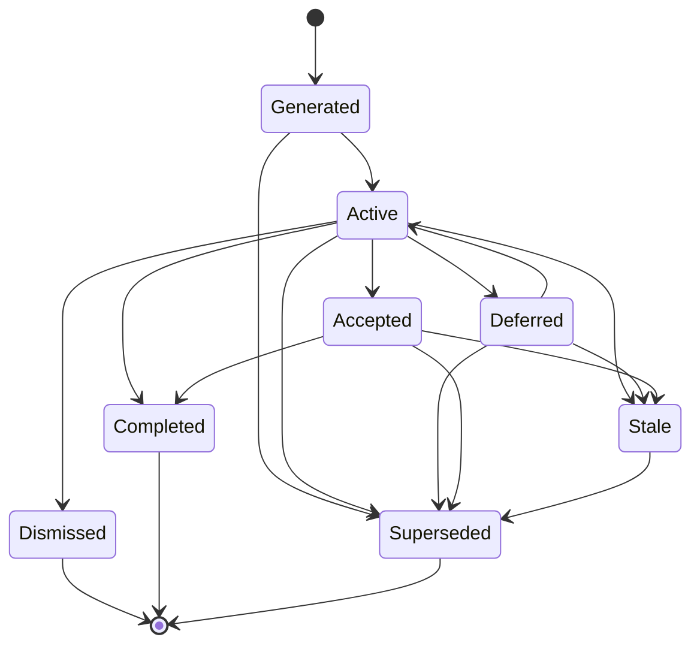

Possible statuses include:

* `generated`
* `active`
* `accepted`
* `deferred`
* `dismissed`
* `completed`
* `stale`
* `superseded`

For the MVP, this may be simplified to:

* `active`
* `accepted`
* `dismissed`
* `completed`
* `stale`

---

### Explanation Structure

A Recommendation should be understandable without requiring the user to inspect the engine's internal model.

A useful explanation may include:

* **What** — The recommended next step.
* **Why** — The reasoning behind it.
* **Why now** — Why it matters at this point.
* **What it enables** — The work or Decisions that become possible afterward.
* **What blocks it** — Any unresolved dependency.
* **What it depends on** — Relevant Assumptions.
* **What it protects** — Relevant Constraints or SuccessCriteria.
* **What changed** — The Event or state change that triggered the Recommendation.

Example:

> **Recommendation:** Narrow the search to three candidate locations.
>
> **Why:** Housing, employment, healthcare, and moving logistics all depend on location.
>
> **Why now:** Enough information exists to eliminate several regions, but employment requirements are still too uncertain for a final choice.
>
> **What it enables:** Detailed neighborhood research, rental comparisons, and healthcare evaluation.
>
> **Depends on:** The Assumption that spouse employment can remain flexible across the shortlisted areas.

---

### Relationships

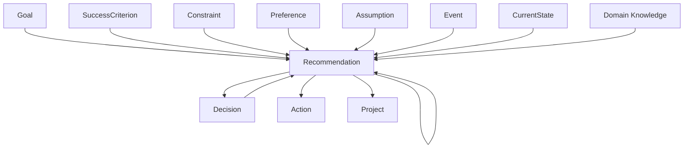

These relationships mean:

* A Recommendation exists within the context of a Goal.
* SuccessCriteria, Constraints, Preferences, Decisions, Assumptions, Events, Current State, and domain knowledge may contribute to its reasoning.
* A Recommendation may propose a Decision, Action, Project, or another Recommendation.
* A later Recommendation may replace an earlier one.

---

### Recommendation Ranking

The engine may produce several valid Recommendations at once.

It then needs to determine which one should be primary.

Possible ranking factors include:

* Urgency.
* Downstream impact.
* Number of blocked items.
* Decision readiness.
* Deadline proximity.
* Constraint risk.
* Assumption uncertainty.
* Reversibility.
* User priority.
* Effort required.
* Value of information.
* Risk reduction.

Example:

| Recommendation                  | Urgency | Downstream impact | Readiness | Primary? |
| ------------------------------- | ------: | ----------------: | --------: | -------- |
| Clarify spouse employment needs |    High |              High |     Ready | Yes      |
| Interview realtors              |  Medium |            Medium |     Ready | No       |
| Select a moving company         |     Low |            Medium | Not ready | No       |

For the MVP, ranking may be rule-based and transparent rather than mathematically scored.

---

### Primary Recommendation

The MVP should present one primary Recommendation at a time.

This does not mean only one Recommendation exists.

It means the engine identifies the one most useful next step.

Example:

#### Primary Recommendation

> Clarify spouse employment requirements.

#### Why it is primary

* The target location Decision depends on it.
* Housing affordability depends on it.
* Several downstream workstreams remain blocked.
* The information can be gathered now.
* Delaying it increases the risk of choosing the wrong location.

Secondary Recommendations may be shown as upcoming or supporting work, but the user should not be overwhelmed with a long list.

---

### Staleness

A Recommendation becomes stale when the reasoning that produced it no longer reflects the current state.

Possible staleness triggers include:

* A related Decision is resolved.
* A key Assumption changes.
* A Constraint changes.
* A deadline passes.
* An Event occurs.
* The user rejects the underlying direction.
* More important work becomes urgent.
* The recommended Action is completed.

Example:

> Research rental markets in the East Bay.

This Recommendation becomes stale if the family decides to focus exclusively on the North Bay.

The engine should mark it stale and generate a replacement rather than silently leaving outdated advice active.

---

### MVP Example

#### Recommendation

> Clarify spouse employment requirements before choosing a final target location.

#### Type

> Validate and prepare.

#### Status

> Active.

#### Why

> Employment location, compensation, commute expectations, and work arrangement directly affect housing affordability and which areas remain viable.

#### Why now

> The target location Decision is high leverage, but it is only partially ready. Clarifying employment requirements will reduce the largest remaining uncertainty.

#### Related Decision

> Choose the target location.

#### Related Assumption

> Spouse can find meaningful work that supports the household's expected cost of living.

#### Related Constraints

* Housing must remain below the approved limit.
* The family must remain within 1.5 hours of relatives.
* The location must not expose the household to unacceptable environmental risk.

#### Downstream effects

Following this Recommendation will improve:

* Location comparison.
* Housing-budget accuracy.
* Commute evaluation.
* Move sequencing.
* Decision readiness.

#### Review trigger

> Re-evaluate when spouse employment requirements become clearer or a job opportunity becomes location-specific.

---

### Distinction From Related Concepts

#### Recommendation vs Decision

A **Decision** is a choice that must be made.

> Choose the target location.

A **Recommendation** advises the user how to approach that choice.

> Narrow the target location now, but wait to make the final choice until employment requirements are clearer.

#### Recommendation vs Action

An **Action** is work performed.

> Research employers in three candidate regions.

A **Recommendation** explains whether and why that Action should happen.

> Research employers now because employment flexibility is the largest unresolved dependency.

#### Recommendation vs Task

A **Task** is an execution item.

> Contact three realtors.

A **Recommendation** may create, prioritize, postpone, or reject that Task.

> Begin contacting realtors now because the home-preparation timeline depends on understanding likely listing requirements.

#### Recommendation vs Explanation

A Recommendation is the advice itself.

The Explanation communicates the reasoning behind it.

For the MVP, Explanation may remain embedded within Recommendation rather than becoming a separate domain concept.

#### Recommendation vs Rule

A **Rule** is reusable domain knowledge.

> Interstate movers often require significant advance notice.

A **Recommendation** applies that Rule to the user's current situation.

> Begin interviewing movers this month because the target window is approaching the typical booking lead time.

---

### User Response

The user should be able to respond to a Recommendation in several ways:

* Accept it.
* Dismiss it.
* Defer it.
* Complete it.
* Ask why.
* Correct the engine's understanding.
* Add missing information.
* Choose a different direction.

A user response should become new information for the reasoning engine.

Example:

> I do not want to research jobs yet because my spouse plans to speak with their current employer first.

The engine should update:

* Current State.
* Decision readiness.
* Sequencing.
* Recommendation status.
* The next Recommendation.

---

### Open Questions

* Should Explanation become its own concept later?
* Does every Recommendation need a confidence level?
* Should the engine show one Recommendation or several?
* How should ranking work in the MVP?
* Can the user accept a Recommendation without completing it?
* What is the difference between `dismissed` and `deferred`?
* Should dismissing a Recommendation require a reason?
* Should a Recommendation always point to a Decision or Action?
* How should Recommendations that advise waiting be represented?
* Should the engine generate Recommendations automatically after every state change?
* How should Recommendation history be preserved?
* Can one Recommendation depend on another?
* Should stale Recommendations remain visible for transparency?
* Does the MVP need explicit review triggers?
* Should the engine explain why competing Recommendations were not selected?

For the MVP, Recommendation can remain a focused concept with:

* Title
* Type
* Status
* Reasoning
* Why now
* Related Decision or Action
* Dependencies
* Blocked items
* Related Assumptions
* Generated date
* Optional review trigger
