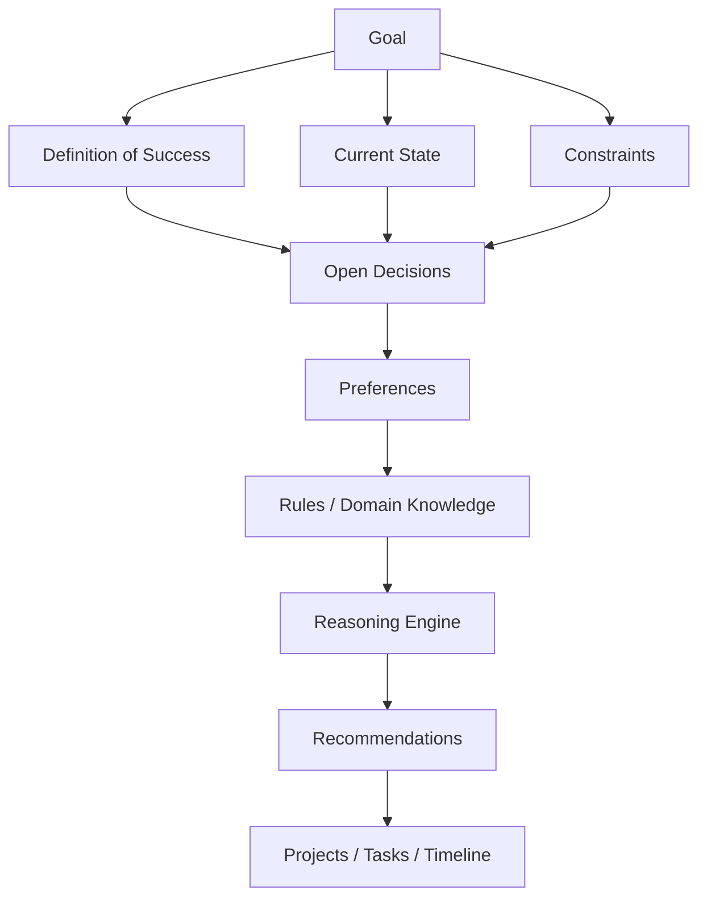
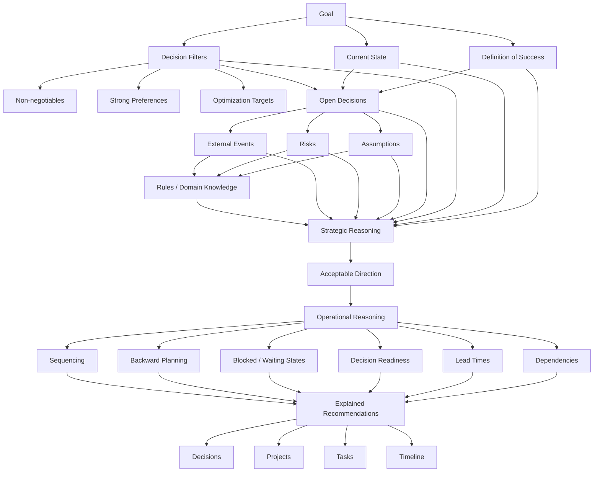

# The GoTime Reasoning Engine

If `AGENTS.md` defines how we build GoTime, then `reasoning-engine.md` should define how GoTime thinks.

Whenever we debate a feature, we should be able to point to this document and ask:

> "Does this make the reasoning engine better?"

If the answer is yes, we're probably moving in the right direction.

## Purpose
The reasoning engine exists to continuously evaluate the current state of a user's plan and recommend the work most likely to help achieve the goal successfully.

# GoTime Reasoning Architecture

## Version 1 — Foundational Model

This was our first architecture diagram for how GoTime thinks.

It captures the core idea that GoTime begins by understanding the user's situation. Projects, tasks, and timelines are outputs of the reasoning process rather than its starting point.

### Mermaid Diagram

### Layered Architecture

#### Layer 1 — Goal

The outcome the user is trying to achieve.

Examples:

* Relocate the family to California.
* Retire with financial security.
* Complete a home renovation.
* Plan a wedding.

---

#### Layer 2 — Situation Understanding

The engine first develops an understanding of the user's circumstances.

This includes:

* Definition of Success
* Current State
* Constraints

The purpose of this layer is to establish what the user wants, where they are now, and which boundaries an acceptable plan must respect.

---

#### Layer 3 — Decisions and Preferences

The engine identifies:

* Open Decisions
* Preferences

Open decisions represent choices that have not yet been made.

Preferences help the engine compare otherwise acceptable alternatives.

---

#### Layer 4 — Expert Knowledge

The engine applies:

* Rules
* Domain Knowledge
* Typical lead times
* Best practices
* Heuristics

This layer represents the knowledge an experienced advisor or project manager would bring to the situation.

---

#### Layer 5 — Reasoning

The reasoning engine combines the user's situation with relevant domain knowledge.

It evaluates:

* What matters most
* What remains unresolved
* What is possible
* What should happen next

---

#### Layer 6 — Recommendations

The engine produces explained recommendations.

A recommendation should communicate:

* What should happen
* Why it should happen
* Why it should happen now

---

#### Layer 7 — Execution

Recommendations may produce or modify:

* Projects
* Tasks
* Decisions
* Milestones
* Timelines

Execution artifacts are downstream outputs of reasoning rather than the center of the product.

---

## Version 2 — Expanded Working Model

This version expands the foundational model to include decision filters, assumptions, risks, strategic reasoning, and operational sequencing.

It is a working model rather than a final architecture.

### Mermaid Diagram

### Layered Architecture

#### Layer 1 — User Intent

This layer defines what the user is trying to accomplish and what a successful outcome would look like.

It includes:

* Goal
* Definition of Success

The goal identifies the desired destination.

The definition of success describes the conditions that would make the result genuinely worthwhile.

Success may have several dimensions:

* Financial
* Career
* Family
* Health
* Lifestyle
* Time
* Emotional well-being

---

#### Layer 2 — Current Situation

This layer describes the user's present reality.

It includes:

* Current State
* Existing commitments
* Available resources
* Decisions already made
* Known deadlines
* Relevant people
* Existing projects or actions

The engine must understand the difference between the user's desired state and current state before it can recommend a useful path forward.

---

#### Layer 3 — Decision Filters

Decision filters determine which potential plans are acceptable.

They include three levels.

##### Non-negotiables

A recommendation that violates a non-negotiable should normally be rejected.

Examples:

* Do not exceed a fixed housing budget.
* Do not live beyond a maximum distance from family.
* Do not consider homes with HOA fees.

##### Strong Preferences

Violating these does not automatically invalidate a plan, but plans that satisfy them should rank more highly.

Examples:

* Keep the family from living apart for more than two months.
* Provide outdoor living space.
* Stay near desirable amenities.

##### Optimization Targets

These help compare multiple acceptable plans.

Examples:

* Minimize moving expenses.
* Reduce commute time.
* Increase access to employment.
* Maximize financial flexibility.

---

#### Layer 4 — Uncertainty and Change

This layer represents information that is incomplete, uncertain, or capable of changing the plan.

It includes:

* Open Decisions
* Assumptions
* Risks
* External Events

##### Open Decisions

Choices that have not yet been made.

Examples:

* Which city should we choose?
* Should we rent or buy?
* Which realtor should we hire?

##### Assumptions

Things currently treated as true but not yet confirmed.

Examples:

* The current home will sell above a minimum price.
* A spouse will find suitable employment.
* The destination will remain unchanged.

##### Risks

Possible developments that could negatively affect the plan.

Examples:

* The home takes longer than expected to sell.
* Employment opportunities are more limited than expected.
* Housing costs rise beyond the planned range.

##### External Events

Things that happen outside the user's direct control.

Examples:

* A home sale closes.
* A job offer arrives.
* Interest rates change.
* A lease expires.

Changes in this layer should trigger re-evaluation.

---

#### Layer 5 — Expert Knowledge

This layer contains reusable knowledge about the domain.

It includes:

* Rules
* Typical lead times
* Dependencies
* Best practices
* Heuristics
* Common failure modes
* Regulatory or procedural requirements

Examples for relocation might include:

* Interstate movers often need to be reserved well in advance.
* Some housing decisions depend on employment location.
* Home repairs may need to precede listing photography.
* School or childcare research may depend on neighborhood selection.

This knowledge may come from experts, curated rules, historical data, or AI-assisted research.

---

#### Layer 6 — Strategic Reasoning

Strategic reasoning asks:

> Are we pursuing an acceptable direction?

It evaluates candidate approaches against:

* The goal
* The definition of success
* Current circumstances
* Decision filters
* Assumptions
* Risks
* Open decisions
* Domain knowledge

Its purpose is to determine which plans remain viable and which should be rejected.

Strategic reasoning may conclude:

* This option violates a non-negotiable.
* This plan exposes the family to too much financial risk.
* This direction best supports the user's stated success criteria.
* More information is required before choosing among the remaining options.

The output of this layer is an acceptable direction or a reduced set of viable alternatives.

---

#### Layer 7 — Operational Reasoning

Operational reasoning asks:

> Given the chosen direction, what should happen next?

It includes:

* Dependencies
* Sequencing
* Lead times
* Decision readiness
* Blocked work
* Waiting states
* Backward planning

##### Dependencies

Identifies which actions or decisions require something else to happen first.

##### Sequencing

Determines the appropriate order of decisions, events, and actions.

##### Lead Times

Accounts for how long work typically takes and how far in advance it should begin.

##### Decision Readiness

Determines whether enough information exists to make a decision responsibly.

The engine may conclude:

* This decision is ready to be made.
* This decision should wait for employment information.
* Research can begin now, but final selection is premature.

##### Blocked Work

Work that cannot proceed because a prerequisite has not been completed.

##### Waiting States

Work that cannot proceed because information or action is expected from an external source.

##### Backward Planning

Starts from a target event or date and works backward to determine when prerequisite decisions and actions must occur.

---

#### Layer 8 — Explained Recommendations

Recommendations should be transparent rather than presented as unexplained instructions.

Each recommendation should ideally communicate:

* What is recommended
* Why it matters
* Why it should happen now
* What it enables
* What it is blocked by
* Which risks it reduces
* Which alternatives were rejected
* Which assumptions the recommendation depends upon

Example:

> Select the target city before committing to long-term housing. Employment location and proximity to family affect which neighborhoods satisfy your constraints, so choosing housing now could create unnecessary cost or require reversing the decision later.

---

#### Layer 9 — Execution Outputs

The reasoning engine may produce or update:

* Decisions
* Projects
* Tasks
* Milestones
* Timelines
* Reminders
* Research requests

These are the practical manifestations of the engine's conclusions.

They are not the reasoning engine itself.

---

#### Layer 10 — Continuous Re-evaluation

The reasoning process is not performed only once.

The engine should reconsider its recommendations when:

* A decision is made
* An assumption is confirmed or invalidated
* A risk increases
* An external event occurs
* A deadline approaches
* A task is completed
* A dependency changes
* The user's preferences change
* The definition of success changes

GoTime therefore manages an evolving state rather than a static task list.

---

## Core Product Principle

A reasoning engine without sequencing is only an advisor.

A sequencing engine without reasoning is only a scheduler.

GoTime combines both:

* Strategic reasoning determines the right direction.
* Operational reasoning determines what should happen next.
* Transparent recommendations explain how and why those conclusions were reached.

## Core Responsibilities
+ Understand the user's goal.
+ Build and maintain a plan.
+ Detect risks.
+ Identify blockers.
+ Recommend next actions.
+ Explain recommendations.
+ Adapt as circumstances change.

## What GoTime Knows
### Facts
> Things supplied by users or observed by the system.

Examples:
+ Move date
+ Current progress
+ Assigned people
+ Budget
+ Task completion

### Rules
> Things GoTime knows about the world.

Examples:
+Interstate movers are often booked well in advance.
+Some tasks depend on others.
+Certain deadlines are dictated by law or policy.

### Inferences
> Conclusions drawn from facts and rules.

Examples:
+ This task is blocked.
+ You should complete this before next Friday.

## How GoTime Reasons
Not algorithms.
A pipeline.

Something like:
Facts > Rules > Current State > Analysis > Recommendation > Explanation

## Events That Trigger Re-evaluation
For example:
+ A task completes.
+ A due date changes.
+ A budget changes.
+ Someone becomes unavailable.
+ A new dependency is added.
+ Today's date changes.
+ The user changes priorities.

Every one of those causes GoTime to think again.

## Recommendations
> The kinds of advice GoTime can give.

Examples:
+ Do this next.
+ You're behind schedule.
+ This task is blocked.
+ You're missing an important step.
+ Consider moving this earlier.
+ This project is at risk.

## Explaining Recommendations
Every recommendation should answer:

> Why?

Not just:

> Schedule movers.

But:

>Schedule movers this week because interstate movers are typically booked 8–12 weeks in advance, and your target move date is June 1.

That explanation is what builds trust.

## Design Principles
+ Recommendations should be explainable.
+ Recommendations should adapt as facts change.
+ The engine should reduce cognitive load.
+ The engine should recommend, not dictate.
+ Confidence should be communicated honestly when appropriate.

## What the Reasoning Engine Is Not
+ It is not a replacement for user judgment.
+ It is not an autonomous project manager.
+ It does not make irreversible decisions.
+ It does not hide why it made a recommendation.

Imagine GoTime had amnesia.
Every minute it wakes up and has forgotten everything except the current database.
How does it rediscover the answer to:
> What should I do next?

I think the sequence is:

Read facts

↓

Build current state

↓

Detect problems

↓

Generate possible actions

↓

Score those actions

↓

Recommend one

↓

Explain why

That right there is your reasoning engine.
But, maybe we have been using using the phrase "reasoning engine" a little too broadly.

I actually think it has three distinct parts:

1) Knowledge
> What does GoTime know?

2) Reasoning   
> What conclusions can it draw?

3) Recommendation
> What should it tell the user?

Those are different responsibilities.

## Designing Through Conversation

The reasoning engine will be designed by simulating conversations between a user and an experienced project manager. Every question the project manager asks reveals information the engine needs. Every recommendation reveals a reasoning capability. Every explanation reveals how the engine should build trust with the user.

Strategic Reasoning
- Goals
- Definition of Success
- Constraints
- Preferences
- Risks
- Assumptions

↓

Operational Reasoning
- Sequencing
- Dependencies
- Lead Times
- Decision Readiness
- Recommendations

> A reasoning engine without sequencing is just an advisor.

> A sequencing engine without reasoning is just a scheduler.

GoTime needs both.

## Future Ideas